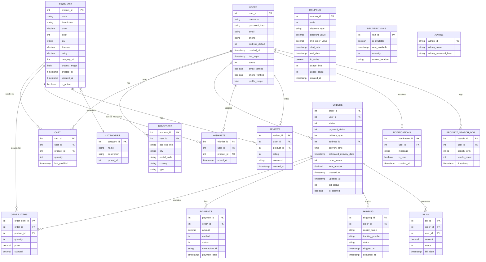

# CS3101-E-Commerce-App-in-C
Below is the main DBMS ER-diagram behind our backend(2F normalized when considering scalability)



## Authors: Shuvam Banerji Seal(22MS076)  and Soumya Ghorai(22MS005)

This is our submission for the project work given by [Dr. Kripabandhu Ghosh](https://orcid.org/0000-0002-8130-1221).

### Below are a brief breakdown of contributions to the major features:

|Feature|Main Contributer|Reason For Inclusion|
|:---:|:---:|:---:|
|DBMS using SQLite3| Both authors have equal contribution| Needed a more scalable and rigid backend|
|BK-Tree Algorithm| Soumya Ghorai| Native spelling rectifier to correct the search terms given by user during retrieval from the database|
|BM-25 Algorithm| Shuvam Banerji Seal | With parameters k1=0.6, b=1.0, found to be good for vague retrieval, can be used as a RAG-like chatbot given smaller chunk-like docs as provided are there|
|GTK4 with Adwaita|Shuvam Banerji Seal|Planned to make gui for the whole app, but due to several constraints, it became not plausible|
|TRIGGERs in SQLite3|Soumya Ghorai| To maintain uniquesness in PK IDs for the users and admins|

## How to Run?
```bash
gcc pkg-config --cflags gtk4 libadwaita-1 chatbot/chatbot-gtk-final.c -o masterchatbot pkg-config --libs gtk4 libadwaita-1 -lm
```
```bash
gcc main.c -o main -lm -lsqlite3       
```
Run the above GCC commands to create the executables.
